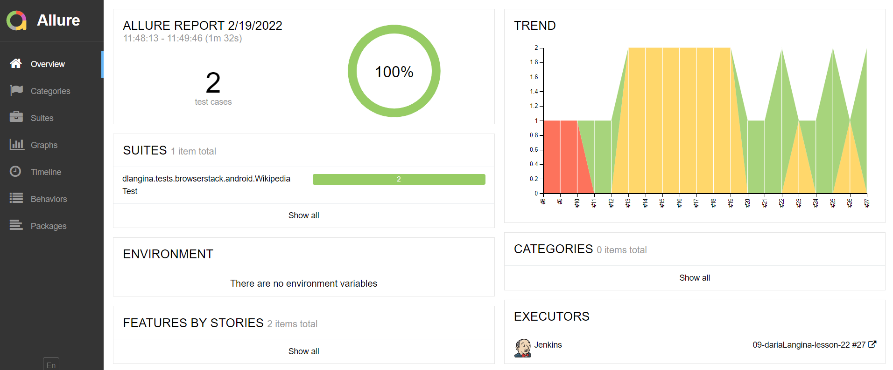
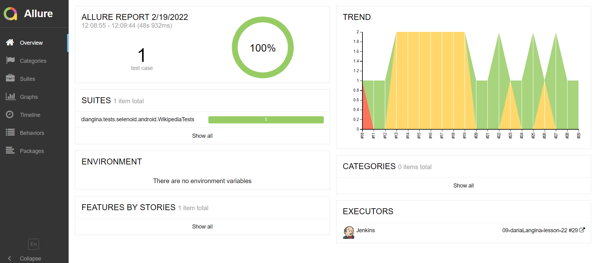
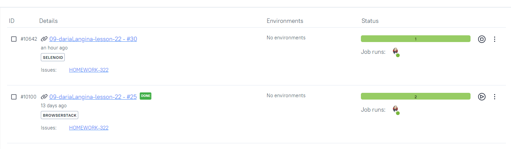
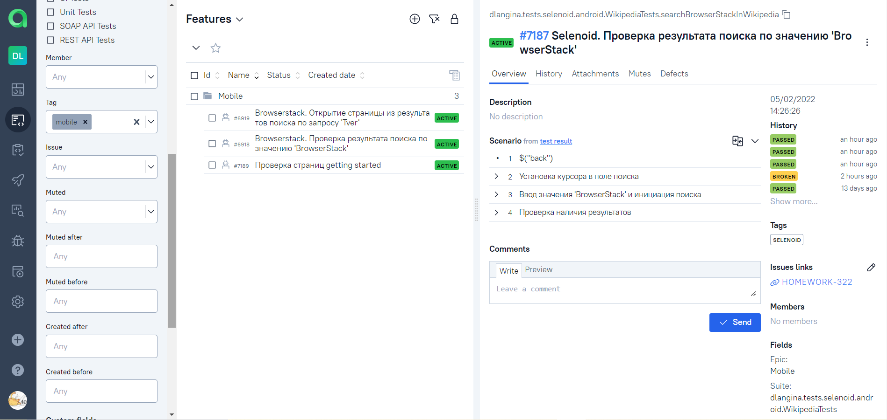
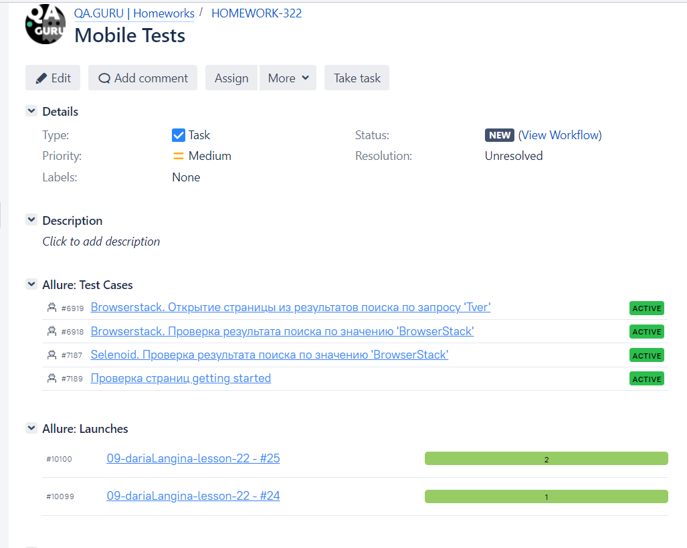
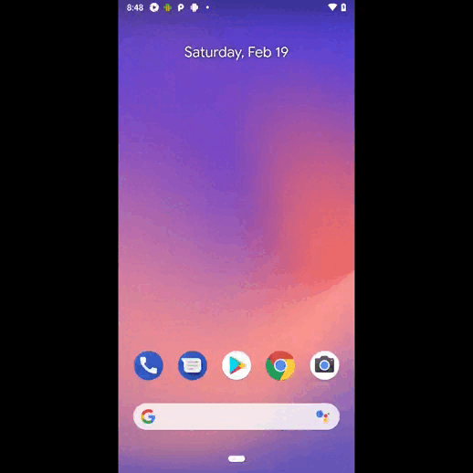
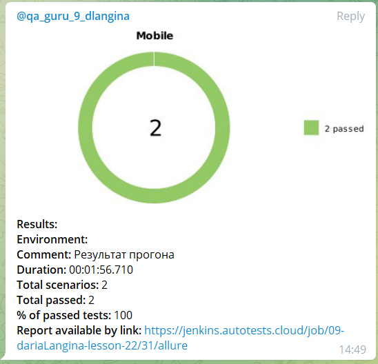
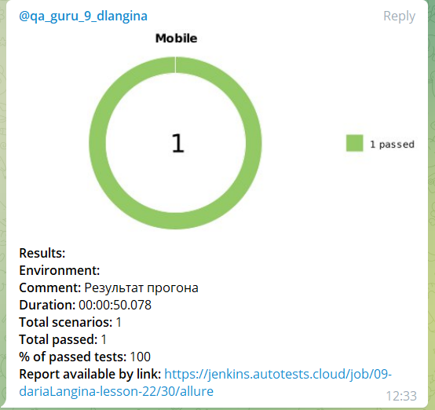
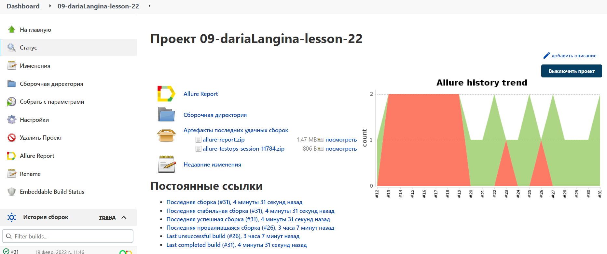
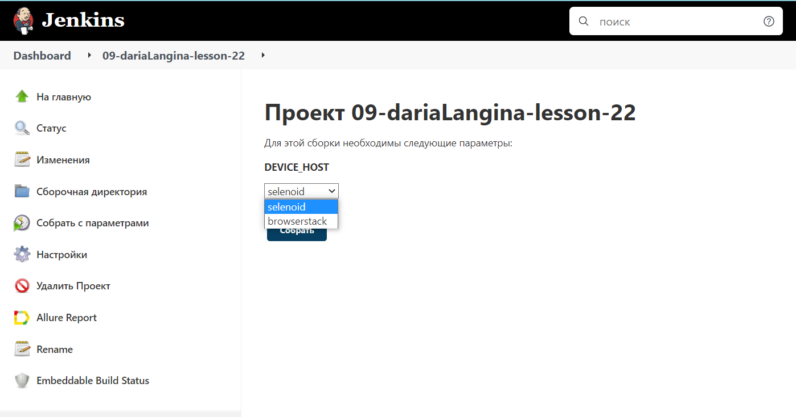

<h1 align="center"> :robot: Проект по автоматизации тестирования в рамках обучения на курсе QA.GURU </h1>

## :rocket: Технологический стек

IntelliJ IDEA, Java, Gradle, JUnit5, Selenide, Selenoid, Jenkins, Allure Report, Allure TestOps,
Jira, Github, Telegram

<p  align="center"

<code></code>
<code></code>
<code></code>
<code></code>
<code></code>
<code></code>
<code></code>
<code></code>
<code></code>
<code></code>
<code></code>
<code></code>
</p>

## UI тесты

* ✅ Selenoid. Проверка результата поиска по значению 'BrowserStack'
* ✅ Browserstack. Проверка результата поиска по значению 'BrowserStack'
* ✅ Browserstack. Открытие страницы из результатов поиска по запросу 'Tver'
* ✅ Проверка страниц getting started


### Отчёт о прохождении автотестов в Allure Report

<p align="center">
  
</p>

<p align="center">
  
</p>

### Хранение тестовой документации в Allure TestOps

<p align="center">
  
</p>

<p align="center">
  
</p>

### Интерграция с Jira

<p align="center">
  
</p>

### Пример запуска теста в Selenoid

<p  align="left"
<code></code>
</p>

### Пример запуска теста в BrowserStack

<p  align="left"
<code></code>
</p>

### Уведомления о прохождении автотестов в Telegram

<p align="center">
  
</p>

<p align="center">
  
</p>

Serve report:

```bash
allure serve build/allure-results
```

### Запуск в Jenkins

Статистика по запускам <br >
<p align="center">
  
</p>

Параметры запуска <br >
<p align="center">
  
</p>

### Как запустить

Перед выполением необходимо:

* запустить сервер (browserstack или selenoid)

### Запуск тестов с помощью BrowserStack:

```
gradle clean test -DdeviceHost=browsertack
```

### Запуск тестов с помощью Selenoid:

```
gradle clean test -DdeviceHost=selenoid
```

### Запуск тестов с незаполненными свойствами browserstack:

```
gradle -DdeviceHost=browserstack -Duser={put here browserstack user} -Dkey={put here browserstack access key} -Dapp={put here your browserstack app id} clean test
```

:heart: <a target="_blank" href="https://qa.guru">qa.guru</a><br/>
:blue_heart: <a target="_blank" href="https://t.me/qa_automation">t.me/qa_automation</a>
